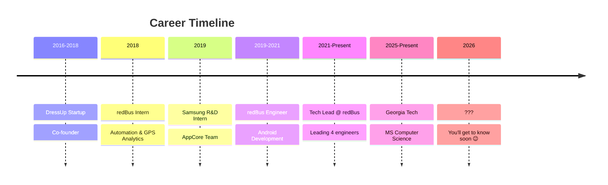

<div align="center">
  
# 👨‍💻 Ayush Shrivastava

### Tech Lead @ redBus | Android Architect | AI Enthusiast

[](https://ayush016.github.io/)
[](https://www.linkedin.com/in/ayushshrivastava016/)
[](https://medium.com/@ayush.shrivastava016)
[](https://github.com/ayush016)

</div>

---

## 🚀 About Me

```kotlin
val techLead = Developer(
    name = "Ayush Shrivastava",
    role = "Tech Lead - Android",
    company = "redBus (MakeMyTrip)",
    location = "Bangalore, India",
    education = "MS Computer Science @ Georgia Tech (In Progress)",
    
    currentFocus = listOf(
        "Building Android systems at scale (50M+ users)",
        "AI-powered developer tooling",
        "Agentic systems with LangChain/LangGraph",
        "Graphics programming with OpenGL ES & AGSL"
    ),
    
    achievements = mapOf(
        "Team Management" to "Leading 4 engineers",
        "Features Delivered" to "50+ large-scale features",
        "CI/CD Impact" to "80% faster release cycles",
        "App Downloads" to "30K+ (Handwritten app)"
    )
)
```

---

## 📊 GitHub Stats

<div align="center">
  


</div>

---

## 🛠️ Tech Stack

### 💻 Languages


### 📱 Mobile & Framework


### 🤖 AI & ML


### 🔧 DevOps & Tools


### ☁️ Cloud & Backend


---

## 🎯 What I Do

<table>
<tr>
<td width="50%">

### 🏗️ Android Architecture
- Production apps serving **50M+ users**
- Jetpack Compose & modern Android
- Custom rendering with OpenGL ES
- Performance optimization at scale

</td>
<td width="50%">

### 🤖 AI & Agentic Systems
- LangChain/LangGraph integrations
- Structured data extraction
- **Featured by LangChain team**
- LLM-powered automation

</td>
</tr>
<tr>
<td width="50%">

### 🛠️ Developer Tooling
- Built CI/CD from scratch
- **80% faster release cycles**
- Jenkins & GitLab pipelines
- Developer experience optimization

</td>
<td width="50%">

### 🎨 Graphics & Rendering
- OpenGL ES & AGSL shaders
- ARCore integrations
- Custom visual effects library
- Real-time rendering systems

</td>
</tr>
</table>

---

## 🏆 Featured Projects

<div align="center">

| 🚀 Project | ⭐ Stars | 📝 Description | 🔗 Link |
|-----------|---------|----------------|---------|
| **OpenGLShaderKit** |  | Android library for shader effects & AR in Compose | [View →](https://github.com/ayush016/OpenGLShaderKit) |
| **Handwritten** |  | Text to handwriting converter • 30K+ downloads | [View →](https://github.com/ayush016/Handwritten) |
| **RoomJetpackCompose** |  | Clean architecture with Room + Flow + Compose | [View →](https://github.com/ayush016/RoomJetpackCompose) |

</div>

### 📦 More Projects

<details>
<summary>Click to expand</summary>

#### 🎯 **ParserGPT** (Featured by LangChain)
AI-powered web scraper converting messy HTML to structured CSVs using LangChain abstractions. Featured on LangChain's LinkedIn/Twitter.
- **Tech:** Python, LangChain, LLMs
- **Impact:** Real-world semantic parsing solution

#### 📱 **Virtual OS for Visually Impaired**
Accessibility-focused web application with voice assistant, built using HCI principles
- **Tech:** Java, Servlets, Web Scraping
- **Impact:** Making technology accessible

#### 🩸 **Blood Bank Management System**
Centralized database and web portal for blood donors and healthcare organizations
- **Tech:** PHP, JavaScript, MySQL
- **Impact:** Healthcare logistics optimization

</details>

---

## ✍️ Latest Writing

<div align="center">

[](https://medium.com/@ayush.shrivastava016)

</div>

I write technical deep-dives about:
- 🏗️ Android internals & architecture patterns
- 🤖 AI tooling & agentic systems  
- ⚡ Performance optimization techniques
- 🔧 Developer productivity & tooling

**Recent Highlight:** ParserGPT architecture explanation - featured by LangChain team

---

## 💼 Professional Journey



### 🎯 Current Role: Tech Lead @ redBus
- 👥 Managing team of 4 engineers
- 🚀 Delivered 50+ large-scale features
- 📊 50M+ active users
- ⚡ 80% improvement in release cycles
- 🏆 Multiple awards: Rookie of the Year, Trailblazer, Titan of the Quarter

---

## 📈 Contribution Activity

<div align="center">


</div>

---

## 🎓 Education & Learning

<table>
<tr>
<td>

**🎓 Georgia Institute of Technology**  
MS in Computer Science (Part-time)  
*2025 - Present*

Focus: Distributed Systems, Compilers

</td>
<td>

**🎓 LNMIT Jaipur**  
B.Tech in Computer Engineering  
*2015 - 2019*

Honors: Rajasthan Hackathon Finalist

</td>
</tr>
</table>

---

## 🤝 Let's Connect!

<div align="center">

Looking to collaborate on:
- 📱 Production-scale Android challenges
- 🛠️ Developer tooling & productivity
- 🤖 Practical AI applications & agentic systems
- 🎨 Graphics programming & custom UI

### 💬 Reach Out

[](mailto:ayush.shrivastava016@gmail.com)
[](https://www.linkedin.com/in/ayushshrivastava016/)
[](https://twitter.com)

</div>

---

<div align="center">
  
### 💭 Currently Exploring

**Agentic Systems** • **Multi-step Reasoning** • **Structured Workflows** • **Android Internals**


⭐️ From [ayush016](https://github.com/ayush016) | Building the future, one commit at a time

</div>
